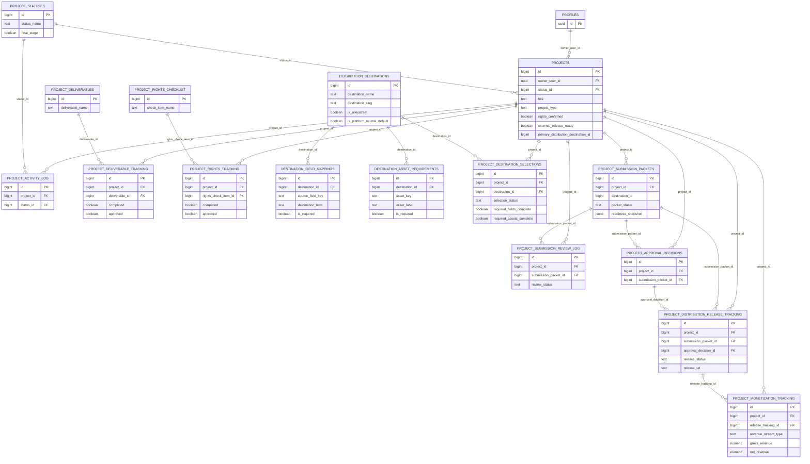

# FilmInHere Current Database ERD

**Captured:** 2026-10-01  
**Source:** verified Supabase Production foreign-key catalog  
**Scope:** current implemented relationships, not proposed future entities.

The current database naturally separates into two connected domains:

1. Production Operations / marketplace / booking.
2. Project Truth / readiness / release pipeline.

Some application identities point directly to Supabase `auth.users`; the public `profiles` table is a one-to-one application profile for those users.

## 1. Identity, marketplace taxonomy and booking

```mermaid
erDiagram
    AUTH_USERS ||--|| PROFILES : "id"
    AUTH_USERS ||--o{ HOST_LISTING_SUBMISSIONS : "user_id"
    AUTH_USERS ||--o{ BOOKING_REQUESTS : "filmmaker user_id"
    AUTH_USERS ||--o{ BOOKING_REQUESTS : "host_user_id"
    AUTH_USERS ||--o{ BOOKING_MESSAGES : "user_id"
    AUTH_USERS ||--o{ BOOKING_OFFERS : "user_id"
    AUTH_USERS ||--o{ POLICY_ACCEPTANCES : "user_id"

    PROFILES ||--o{ PROVIDER_PROFILES : "owner_user_id"

    LISTING_TYPES ||--o{ CATEGORIES : "listing_type_id"
    DEPARTMENTS ||--o{ CATEGORIES : "department_id"

    LISTING_TYPES ||--o{ LISTING_ATTRIBUTES : "listing_type_id"
    DEPARTMENTS ||--o{ LISTING_ATTRIBUTES : "department_id"
    CATEGORIES ||--o{ LISTING_ATTRIBUTES : "category_id"

    LISTING_TYPES ||--o{ RESOURCE_RELATIONSHIPS : "primary_listing_type_id"
    LISTING_TYPES ||--o{ RESOURCE_RELATIONSHIPS : "suggested_listing_type_id"
    DEPARTMENTS ||--o{ RESOURCE_RELATIONSHIPS : "primary_department_id"
    DEPARTMENTS ||--o{ RESOURCE_RELATIONSHIPS : "suggested_department_id"
    CATEGORIES ||--o{ RESOURCE_RELATIONSHIPS : "primary_category_id"
    CATEGORIES ||--o{ RESOURCE_RELATIONSHIPS : "suggested_category_id"

    SHOOT_TYPES ||--o{ SHOOT_REQUIREMENTS : "shoot_type_id"
    LISTING_TYPES ||--o{ SHOOT_REQUIREMENTS : "required_listing_type_id"
    DEPARTMENTS ||--o{ SHOOT_REQUIREMENTS : "required_department_id"
    CATEGORIES ||--o{ SHOOT_REQUIREMENTS : "required_category_id"

    BOOKING_REQUESTS ||--o{ BOOKING_MESSAGES : "request_id"
    BOOKING_REQUESTS ||--o{ BOOKING_OFFERS : "request_id"

    AUTH_USERS {
        uuid id PK
    }

    PROFILES {
        uuid id PK_FK
        text email
        user_role_enum user_role
        knowledge_level_enum knowledge_level
    }

    PROVIDER_PROFILES {
        uuid id PK
        uuid owner_user_id FK
        text provider_type
        text business_name
        boolean is_verified
        text insurance_status
    }

    HOST_LISTING_SUBMISSIONS {
        uuid id PK
        uuid user_id FK
        text listing_type
        text title
        text city
        text state
        text country
        text status
    }

    LISTING_TYPES {
        bigint id PK
        text name
    }

    DEPARTMENTS {
        bigint id PK
        text department
        text sub_department
    }

    CATEGORIES {
        bigint id PK
        bigint listing_type_id FK
        bigint department_id FK
        text category_name
        text subcategory_name
    }

    LISTING_ATTRIBUTES {
        bigint id PK
        bigint listing_type_id FK
        bigint department_id FK
        bigint category_id FK
        text attribute_name
        text field_type
        boolean is_searchable
    }

    RESOURCE_RELATIONSHIPS {
        bigint id PK
        bigint primary_listing_type_id FK
        bigint primary_department_id FK
        bigint primary_category_id FK
        bigint suggested_listing_type_id FK
        bigint suggested_department_id FK
        bigint suggested_category_id FK
        integer weight
    }

    SHOOT_TYPES {
        bigint id PK
        text shoot_type_name
    }

    SHOOT_REQUIREMENTS {
        bigint id PK
        bigint shoot_type_id FK
        bigint required_listing_type_id FK
        bigint required_department_id FK
        bigint required_category_id FK
        text priority
    }

    BOOKING_REQUESTS {
        uuid id PK
        uuid user_id FK
        uuid host_user_id FK
        text listing_id
        timestamptz start_iso
        timestamptz end_iso
        text status
        text thread_status
    }

    BOOKING_MESSAGES {
        uuid id PK
        uuid request_id FK
        uuid user_id FK
        text sender
        text body
    }

    BOOKING_OFFERS {
        uuid id PK
        uuid request_id FK
        uuid user_id FK
        text offer_type
        numeric total
        text status
    }

    POLICY_ACCEPTANCES {
        uuid id PK
        uuid user_id FK
        text policy_key
        text policy_version
    }
```

### Current marketplace-model observation

The taxonomy is substantially modeled, but there is no canonical general resource/listing-instance table tying provider + taxonomy + attributes + geography + availability together. `host_listing_submissions` is currently the closest concrete listing instance, while `provider_profiles` and the taxonomy tables form a separate model.

That split is one of the principal reconciliation decisions documented in the gap matrix.

## 2. Project truth, rights, readiness and distribution



## 3. Relationship integrity observations

The verified foreign-key catalog shows strong relational integrity across most of the project/release pipeline.

Important current exceptions / design observations:

- `project_submission_packets.destination_id` exists as a column but is not currently represented by a verified foreign-key constraint in the catalog output.
- `projects.primary_distribution_destination_id` exists but is not currently represented by a verified foreign-key constraint in the catalog output.
- `project_monetization_tracking.destination_id` exists but is not currently represented by a verified foreign-key constraint in the catalog output.
- `project_distribution_release_tracking.destination_id` exists but is not currently represented by a verified foreign-key constraint in the catalog output.
- Booking `listing_id` is text and therefore does not enforce a relational foreign key to a canonical listing/resource table.
- The current marketplace model does not yet have a canonical resource-instance entity to serve as the relational parent for bookings, availability, geography and provider ownership.

These observations require design review before new constraints are added; no Production constraint changes should be made merely because a relationship appears logically desirable.

## 4. Next ERD state

The target ERD should be produced only after the missing marketplace entities and complete master-project truth model are approved in the Database Requirements Manifest.

The target model should preserve working identifiers/migration paths wherever practical rather than replacing the current schema wholesale.
